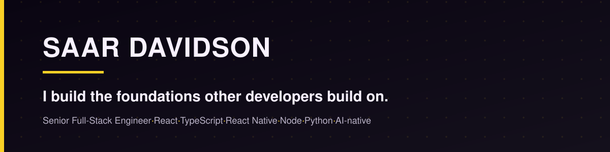

Senior full-stack engineer, frontend-leaning. I build the foundations other developers build on: design systems, component infrastructure, and the performance work that makes a whole team faster. Lately I've pointed the same instinct at AI, shipping LLM features with evals and guardrails instead of prompt-and-hope.

## What I've shipped

- **300,000+ users.** Foundational component infrastructure for monday.com Workdocs, in a large React / Node.js / Ruby on Rails codebase.
- **0 to 60,000 daily users.** A React Native app built from scratch at Autofleet, living in a shared codebase alongside a second live app owned by another team.
- **~50% smaller bundle.** A deep Next.js design-system refactor at Affilomania: compression, atomization, tighter dependency boundaries.
- **~4x faster page delivery.** A reusable component system for Healthy.io's marketing team, days down to hours, plus the compliance Trust Center (FDA, GDPR, ISO 27001, HITRUST).
- **80% job placement.** The Colman Dev Club, the college's first official dev club. I founded it during lockdown; it's still running 6+ years on.

## What I'm building now

### [Beerolog](https://beerolog.com)

An AI beer recommender, and mostly an excuse to build a retrieval system properly.

- Two-stage recommender: pgvector retrieval over OpenAI embeddings shortlists candidates against a user's taste vector, then an LLM scores the shortlist and writes a short "why this one for you."
- A retrieval eval harness (precision@5, MRR) that gates quality in CI, so match-engine changes can't silently regress.
- An online preference loop: free-text ratings parsed by an LLM into flavor-dimension deltas, blended into the user's embedding at a tunable learning rate.
- Python / FastAPI, PostgreSQL / pgvector, React / TanStack, Docker Compose, exposed as an MCP tool.
- Source is private for now.

### Claude Code skills for my own SDLC

- A PR-summary generator that fills a team's PR template from the diff.
- A code review that fans out four clean-context sub-agents across a branch.
- A multi-model consensus review: it detects which agents are installed (Codex, Cursor Agent, Gemini, Copilot), briefs them all on the same diff, runs them in parallel, and weights findings by how many of them agree. Single-tool findings get verified by hand; multi-tool findings get trusted.

The through-line: the bottleneck in 2026 isn't writing code, it's trusting it.

## Stack

| | |
|---|---|
| **Frontend** | React, React Native, Next.js, TypeScript, Remix, Tailwind, design systems, web performance |
| **Backend & data** | Node.js, Python, FastAPI, GraphQL, REST, PostgreSQL / pgvector, Ruby on Rails |
| **AI** | LLM integration (OpenAI), embeddings, RAG and semantic search, retrieval evals (P@5, MRR), MCP |
| **Infra & quality** | Docker, Kubernetes, GCP, Storybook, Cypress, E2E testing |

## Writing

I write, mostly in Hebrew, about shipping with AI agents without losing trust in the code: spec drift, multi-model review, and where the guardrails actually have to go. Latest posts are on [LinkedIn](https://linkedin.com/in/saar-davidson) and [saar.fyi](https://saar.fyi).

---

Open to senior full-stack and AI engineering roles with real product ownership. Best way to reach me is a message on [LinkedIn](https://linkedin.com/in/saar-davidson).
